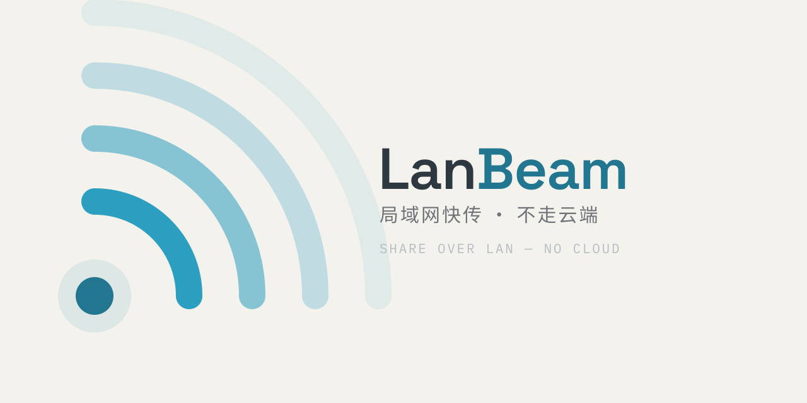
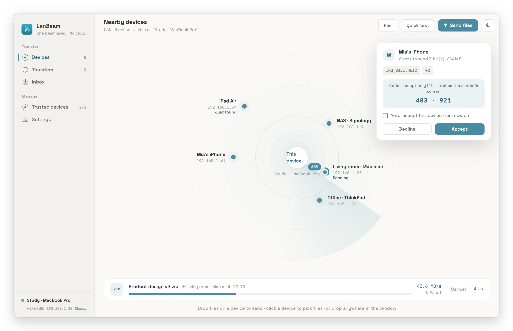
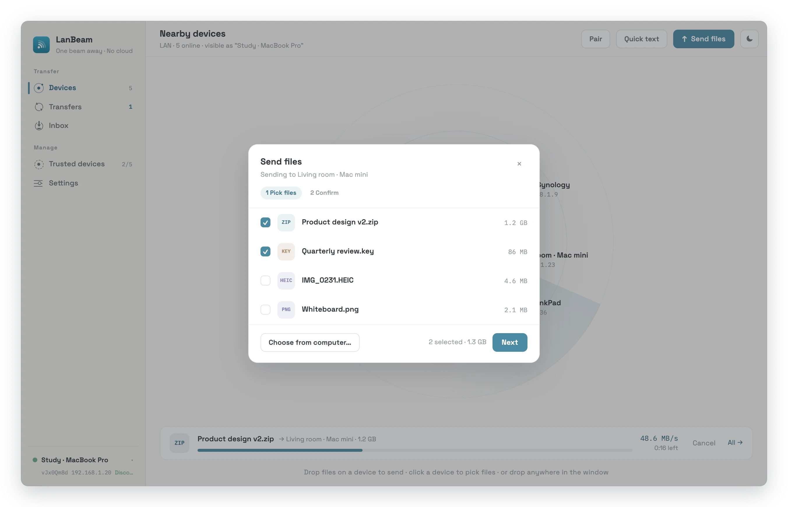
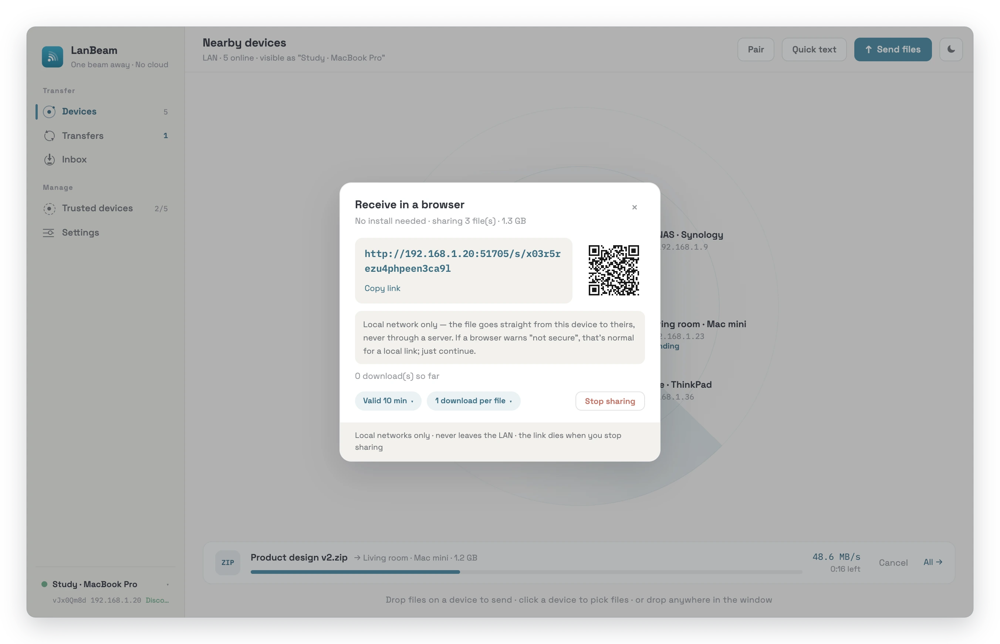
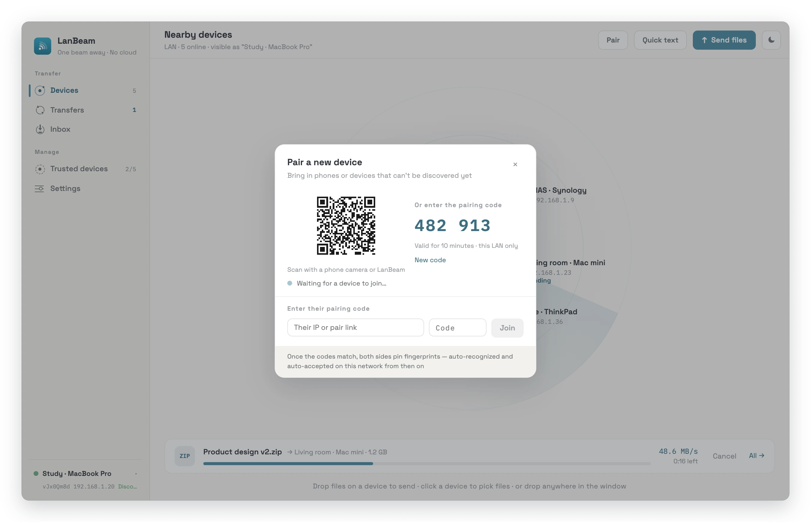
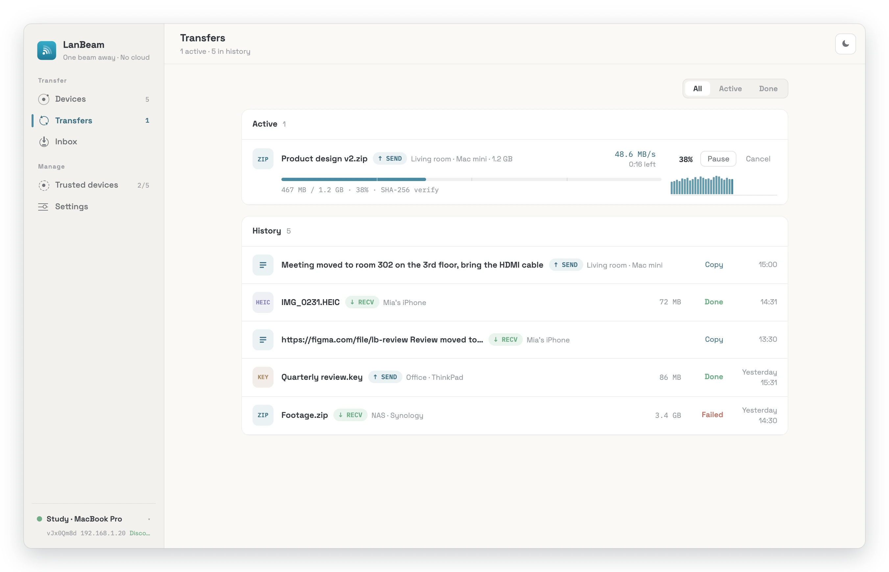
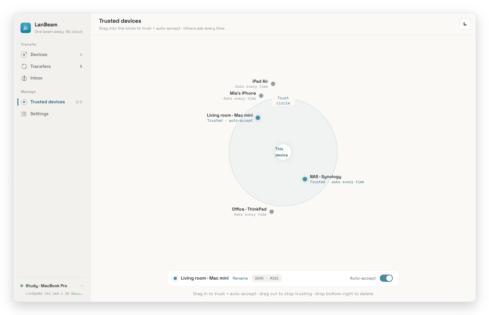
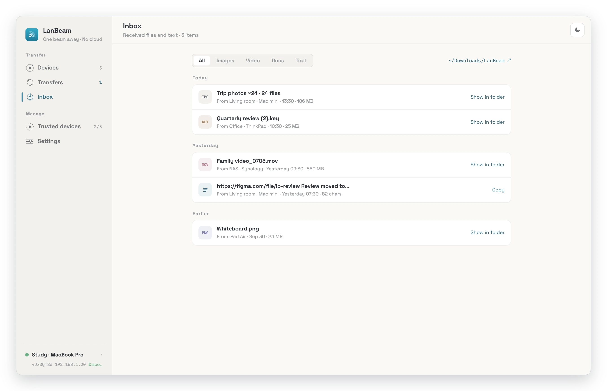
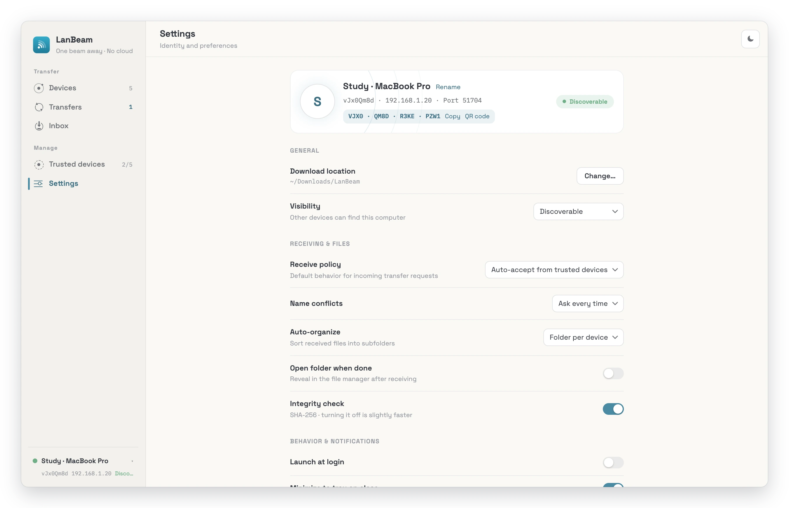
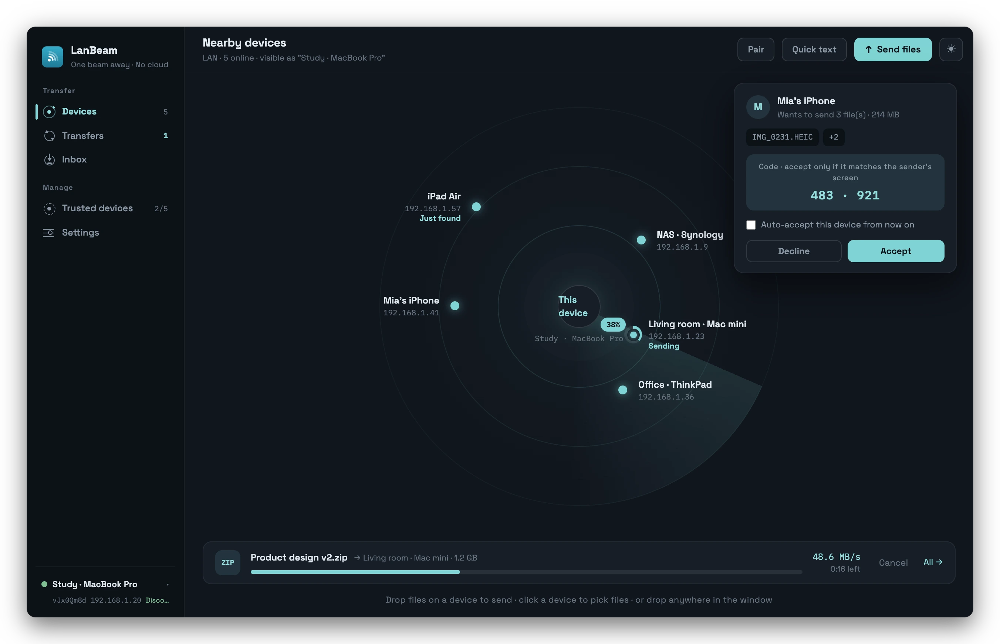

<p align="center">
  <picture>
    <source media="(prefers-color-scheme: dark)" srcset="assets/brand/banner-dark.svg">
    
  </picture>
</p>

<p align="center">
  <a href="https://github.com/Johnserf-Seed/lanbeam/releases/latest"></a>
  <a href="https://github.com/Johnserf-Seed/lanbeam/actions/workflows/ci.yml"></a>
  
  <a href="LICENSE"></a>
</p>

<p align="center"><b>English</b> · <a href="README.zh-CN.md">简体中文</a></p>

> Fast, private, peer‑to‑peer file transfer over your local network — no cloud, no account, no relay.

**LanBeam** sends files (and quick text) directly between devices on the same LAN. Every
transfer runs over an end‑to‑end encrypted channel and never touches the internet. For a
device that doesn't have LanBeam installed, it can also serve a one‑time, link‑based
download over plain HTTP — so a phone browser can grab a file with no app at all.

<picture>
  <source media="(prefers-color-scheme: dark)" srcset="docs/screenshots/en/devices-dark.webp">
  
</picture>

Built with **Tauri 2** (a Rust core + a WebView UI): a native app of a few megabytes that
uses the system's own web runtime (WebView2 on Windows, WebKit on macOS and Linux), so
nothing extra is bundled.

- **Status:** `v0.1.0` — feature‑complete, pre‑release.
- **Platforms:** Windows 10/11, macOS 10.15+, Linux (x64) — installers for all three are
  built by CI on every release.
- **Languages:** English & 简体中文 (in‑app, switchable).

---

## Download

Get the latest version from **[Releases](https://github.com/Johnserf-Seed/lanbeam/releases/latest)**:

| System | File | |
| --- | --- | --- |
| **Windows** 10 / 11 (x64) | `LanBeam_<version>_x64-setup.exe` | Installer — the one most people want |
| | `LanBeam_<version>_x64_en-US.msi` | For managed / scripted deployment |
| | `LanBeam_<version>_x64_portable.exe` | Portable: runs without installing |
| **macOS** 10.15+ | `LanBeam_<version>_universal.dmg` | One build for Apple Silicon and Intel |
| **Linux** (x64) | `LanBeam_<version>_amd64.deb` | Debian, Ubuntu, Mint … |
| | `LanBeam-<version>-1.x86_64.rpm` | Fedora, openSUSE … |
| | `LanBeam_<version>_amd64.AppImage` | Any distribution |

Install it on **every** device you want to transfer between. A phone, or any computer
without LanBeam, can still receive through [browser receive](#transfer).

### First launch

The builds are **not code‑signed yet**, so each OS asks once before the first start:

- **Windows** — if SmartScreen says *"Windows protected your PC"*, choose *More info →
  Run anyway*. When the firewall asks, allow LanBeam on **private** networks: that is what
  lets other devices reach it.
- **macOS** — if macOS can't verify the developer, open *System Settings → Privacy &
  Security* and click *Open Anyway*. Allow **Local Network** access when asked — without
  it LanBeam can't see a single device.
- **Linux** — make the AppImage executable (`chmod +x LanBeam_*.AppImage`), or install a
  package: `sudo apt install ./LanBeam_*_amd64.deb` / `sudo dnf install ./LanBeam-*.x86_64.rpm`.

### Verify a download

Every release carries a `SHA256SUMS.txt`, and every file a
[build‑provenance attestation](https://docs.github.com/actions/security-for-github-actions/using-artifact-attestations)
that ties it to this repository's release workflow and the tagged commit:

```bash
sha256sum -c SHA256SUMS.txt --ignore-missing
gh attestation verify LanBeam_0.1.0_x64-setup.exe --repo Johnserf-Seed/lanbeam
```

---

## Quick start

1. **Open LanBeam on two devices on the same network.** Within a couple of seconds each
   shows up on the other's radar — no setup, no account.
2. **Send.** Drop files onto a device on the radar (or anywhere in the window), or click a
   device to pick files. *Quick text* sends a snippet or a link instead, optionally straight
   onto the other device's clipboard.
3. **Accept.** The receiver sees who is sending what, next to a short code. If it matches
   the code on the sender's screen, accept. Tick *Auto‑accept this device* and files from it
   simply arrive from then on — it's now in your trust circle.
4. **Other side has no LanBeam?** Use *Browser receive*: LanBeam shows a link and a QR code,
   the phone opens it, and the file downloads straight from your computer.
5. **A device doesn't appear?** (another subnet, or discovery blocked) — use *Pair* with a
   6‑digit code or QR, or *Direct IP* with its address.

Received files land in `Downloads/LanBeam`, optionally sorted per device or per date (both
in Settings).

## Screenshots

<table>
  <tr>
    <td width="50%"><br><b>Send</b> — pick files, confirm, done</td>
    <td width="50%"><br><b>Browser receive</b> — a one‑time LAN link + QR for devices without the app</td>
  </tr>
  <tr>
    <td><br><b>Pair</b> — QR or 6‑digit code for devices discovery can't see</td>
    <td><br><b>Transfers</b> — live speed, pause / resume, verified history</td>
  </tr>
  <tr>
    <td><br><b>Trust circle</b> — drag a device in to trust and auto‑accept it</td>
    <td><br><b>Inbox</b> — everything received, files and texts</td>
  </tr>
  <tr>
    <td><br><b>Settings</b> — receive policy, conflicts, integrity, privacy</td>
    <td><br><b>Dark mode</b> — follows the system, or pick one</td>
  </tr>
</table>

---

## Features

### Transfer
- **Direct P2P over the LAN** — devices find each other via a lightweight custom UDP
  discovery protocol (not mDNS) and connect directly; no server in the middle.
- **End‑to‑end encryption** — every session is a `Noise_XX_25519_ChaChaPoly_BLAKE2s`
  handshake (via the [`snow`](https://crates.io/crates/snow) crate). Devices are
  identified by a static X25519 key; a short **SAS** (safety string) lets you verify a
  peer out‑of‑band.
- **Integrity verified** — files are streamed through SHA‑256 and re‑hashed on the
  receiver before they're published (toggleable).
- **Resume, pause & cancel** — interrupted transfers resume from a persisted byte offset;
  pause applies backpressure (bounded, auto‑resumes); cancel frees the slot immediately.
- **Conflict policies** — `rename` (de‑dupe), `overwrite` (crash‑safe: streams to a temp
  and atomically replaces only on full success), or `ask`.
- **Auto‑organize** received files by sending device or by date.
- **Concurrency cap & rate limiting**, plus per‑file progress.
- **Browser receive** — publish an explicit file set over a one‑shot HTTP share: an
  unguessable token URL with a TTL, a **per‑file** download cap (a K‑file share's budget is
  cap × K), and instant stop — LAN‑only, files addressed by index (no path/traversal
  surface). Every share — including a single‑file one — gets a branded landing page that
  renders in **their** language (from `Accept-Language`), and every download
  comes straight back to you: a toast with the downloader's IP, a row in the transfer
  history, an OS notification, and a live counter on the open share panel. **Closing the
  share panel does not stop the share** — a link you handed someone shouldn't die because
  you closed the panel you copied it from — so a live share is always shown in the sidebar,
  and that indicator is how you get back to it and stop it.

### Pairing & reach
- **Pairing** — a 6‑digit code (10‑minute TTL), a scannable QR, or a [`lanbeam://` deep
  link](#deep-links-lanbeam). Redeeming a code proves the code, not the device holding it:
  **both screens then show the same SAS, and trust is recorded only once a human confirms
  it — independently, on each side.** The handshake never grants trust on its own.
- **IP direct connect** for peers that automatic discovery can't see (different subnet).
- **Quick text** — send a snippet/link over the encrypted channel, optionally dropped on
  the receiver's clipboard. Text has no accept prompt, so it obeys the rule files do: a
  sender you don't trust is dropped — **and the ack says so, so the sender gets a real
  error instead of a false "delivered"**. Per‑source flood control on top.

### Privacy & system integration
- **Metadata stripping** — remove EXIF / ICC / XMP from JPEG/PNG/WebP on send, via
  container surgery (no re‑encode; pixels stay byte‑identical).
- **Trust store** — remembered peers (`deviceId → name, auto‑accept, paired‑at`). Trusting
  a device also turns on auto‑accept (that's what "these are my devices" means); you can
  switch auto‑accept back off per device to keep confirming its transfers. **Deleting** a
  device drops its trust row *and* the manually‑added address that kept it in the list —
  untrusting alone never could — and LanBeam refuses to file *itself* as a peer.
- **Fingerprint changed** — when a remembered name turns up under a **different key**, the
  alert shows both fingerprints side by side. It **revokes nothing automatically**: the new
  key was never trusted, because it is simply a different device. The two honest ways out
  are to delete the old record, or to **pair with the new one** like any other device —
  which is the only flow that puts the same code on both screens.
- **A tray that's a real remote** — status (device + LAN IP), send / quick‑text / browser
  share / pair, a live discoverable tick, open‑download‑folder, jump straight to Inbox /
  Transfers / Settings, quit.
  It follows the app's language, and its tick stays in sync with the sidebar both ways.
- **It behaves like a desktop app, not a web page** — the browser context menu is replaced
  by an app‑native Cut/Copy/Paste menu, and the WebView's browser shortcuts (Ctrl+F's find
  bar, Ctrl+P, Ctrl+S, Ctrl+U) are suppressed. DevTools ship only in dev builds.
- **Interface scale** — 80–150%, for a high‑DPI display or just for eyes. It zooms the
  webview **and raises the window's minimum size to match**: a zoom shrinks the CSS
  viewport, so a floor that ignored it would let you scale the interface straight off the
  edge of its own window. `Ctrl` `+` / `-` / `0` drive the app's own setting — the
  webview's native zoom stays off, because browser chrome isn't a feature here.
- Close‑to‑tray, native notifications, launch‑at‑login, an opt‑in global hotkey,
  network‑interface filtering, and one‑click identity reset.

---

## FAQ & troubleshooting

<details>
<summary><b>Two devices don't see each other</b></summary>

- They must be on the same network, and the network must let devices talk to each other:
  guest Wi‑Fi and "AP / client isolation" block exactly that, and so do some VPNs.
- **Windows:** the network should be a *Private* network, with LanBeam allowed through the
  firewall on private networks.
- **macOS:** *System Settings → Privacy & Security → Local Network* must allow LanBeam.
- Different subnets, or a router that drops multicast and broadcast: use **Pair** or
  **Direct IP** — both connect straight to an address, no discovery needed.
- Ports, if you manage a firewall yourself: discovery is UDP `51703` (multicast
  `239.255.61.17` + broadcast), transfers are TCP `51704` (changeable in Settings), and
  browser shares are served from a random port picked at launch.
</details>

<details>
<summary><b>Does anything go to the internet?</b></summary>

No. Discovery, transfers and browser shares stay on the LAN — the share server even refuses
any request from outside a private network. There is no account, no telemetry and no update
check, and the UI's fonts are bundled rather than fetched.
</details>

<details>
<summary><b>Where are received files, settings and logs?</b></summary>

Files go to `Downloads/LanBeam` unless you pick another *Download location*. Settings and
logs live in a `LanBeam` folder in the usual place for your OS:

| | Data | Logs |
| --- | --- | --- |
| Windows | `%APPDATA%\LanBeam` | `%LOCALAPPDATA%\LanBeam\logs` |
| macOS | `~/Library/Application Support/LanBeam` | `~/Library/Logs/LanBeam` |
| Linux | `~/.local/share/LanBeam` | `~/.config/LanBeam/logs` |

The device's private key is not among them — it lives in the OS keychain.
*Settings → Export diagnostics* bundles the logs and a network self‑check into one file.
</details>

<details>
<summary><b>macOS asks for keychain access after an update</b></summary>

LanBeam keeps its device key in your login keychain. The builds are ad‑hoc signed, so macOS
sees each new version as a different app and asks once whether it may read the key —
choose *Always Allow*. That key *is* the device's identity: it is what your peers have
pinned.
</details>

<details>
<summary><b>Linux: LanBeam won't start, or has no tray icon</b></summary>

- The device key is stored through the Secret Service, so a keyring must be running —
  GNOME Keyring or KWallet. Desktop environments ship one; on a bare window manager,
  install `gnome-keyring`.
- The tray needs AppIndicator support. Stock GNOME (Fedora, for example) needs the
  *AppIndicator and KStatusNotifierItem Support* extension. Without it, closing the window
  hides LanBeam to a tray you can't see — start LanBeam again to bring the window back, or
  turn off *Minimize to tray on close* in Settings.
</details>

---

## Security model (at a glance)

- The device's X25519 private key lives in the **OS keychain** (`keyring`), never on disk
  in plaintext.
- All peer traffic is encrypted end‑to‑end (Noise); the app opens no internet connections.
- Untrusted input is treated as hostile: manifest names/sizes/counts are bounded, received
  paths are sanitized against traversal and Windows reserved‑name/ADS tricks, and pairing
  is TOFU + user‑confirmed with an out‑of‑band SAS check. A `lanbeam://` deep link may only
  *surface*, *pre‑fill* or *navigate* — never act (see below).
- The browser‑share server listens on all interfaces — it has to, or a DHCP renewal would
  kill every live share — so **LAN‑only is enforced per request, in middleware, before any
  handler runs**: anything from outside a private network is refused, and it never learns
  whether the token was even real. (Private networks, not "my own subnet": peers on a
  *different* subnet are deliberately supported.) It serves only the explicit file set by
  index, gated by the token + TTL + per‑file download cap on every request.

Dependency advisories are tracked with `cargo audit`; accepted transitive findings are
documented in [`src-tauri/.cargo/audit.toml`](src-tauri/.cargo/audit.toml).

---

## Deep links (`lanbeam://`)

Anything can hand the OS a `lanbeam://` link — a web page, a QR code, a chat message. So
LanBeam treats every one of them as **hostile input**, and the whole scheme is built around
a single invariant:

> **A deep link may only SURFACE the window, PRE‑FILL a field, or NAVIGATE to a page.
> It may never pair, connect, send, trust, share, or change a setting.**

A link that decides something for you is a link an attacker gets to decide with. That's why
there is deliberately no `lanbeam://send`, no `lanbeam://trust`, no `lanbeam://accept` —
and why adding one is the change that must never be made.

| Link | What it does | What it does **not** do |
| --- | --- | --- |
| `lanbeam://pair?d=…&n=…&a=…&p=…&c=…` | Opens the pairing form, pre‑filled | Pair. You still confirm the SAS. |
| `lanbeam://text?t=<urlencoded>` | Opens quick‑text with the body pre‑filled | Send. You still pick the device. |
| `lanbeam://connect?a=<ip[:port]>` | Lands on Devices with the address pre‑filled | Dial. You still press **Direct IP**. |
| `lanbeam://devices` · `transfers` · `inbox` · `settings` | Navigates to that page | Carry any payload |
| `lanbeam://open` | Just brings the window to the front | Anything else |

An unknown command is **dropped, not guessed at**, and link‑supplied values are length‑capped
so a link can't stuff the UI. The backend never interprets the link at all: it checks the
scheme, surfaces the window, and hands the raw URL to the webview
([`src/lib/deepLink.ts`](src/lib/deepLink.ts) owns the allowlist and the parsing, and is
unit‑tested against exactly the kinds of links an attacker would try).

Cold starts work too: a link that *launches* the app is stashed by the backend and replayed
once the UI mounts (Tauri events have no replay).

---

## Tech stack

| Layer | Choices |
|---|---|
| Shell | Tauri 2 (Rust) + the system WebView (WebView2 / WebKit) |
| Backend | Rust, `tokio`, `snow` (Noise), custom UDP discovery, `axum` (share server), `img-parts` (EXIF), `keyring`, `sha2` |
| Frontend | React 19, TypeScript (strict), Vite, `zustand`, `react-i18next` |
| Tooling | pnpm, Biome (lint/format), Vitest, `cargo clippy` / `rustfmt` / `cargo-llvm-cov`, Playwright (screenshots) |

---

## Building from source

### Prerequisites
- [Rust](https://www.rust-lang.org/tools/install) — stable toolchain (≥ 1.85)
- [Node.js](https://nodejs.org) ≥ 20.19 and [pnpm](https://pnpm.io). The pnpm version is
  pinned in `package.json` (`packageManager`); `corepack enable`, or any pnpm ≥ 9.7, picks
  it up automatically.
- The [Tauri 2 system prerequisites](https://tauri.app/start/prerequisites/) for your OS
  (on Windows: the MSVC build tools + the WebView2 runtime, which ships with Windows 10/11;
  on Linux: the packages installed in [`ci.yml`](.github/workflows/ci.yml)).

### Install
```bash
pnpm install
```

### Develop
```bash
pnpm tauri dev      # run the desktop app with hot‑reload
# or just the web UI in a browser (backend calls fall back to demo stubs):
pnpm dev            # then open http://localhost:1420/?demo=1 for sample content
```

### Build
```bash
pnpm tauri build    # every bundle for the host platform, under
                    # src-tauri/target/release/bundle/
```

### Screenshots
```bash
pnpm screenshots    # regenerate docs/screenshots/ from the browser demo
```
Uses a locally installed Chrome or Edge (or `CHROME_PATH`); see
[`scripts/screenshots.mjs`](scripts/screenshots.mjs) for options.

---

## Project layout

```
.
├── .github/workflows/    # ci.yml (lint + tests, 3 OSes) · release.yml (installers)
├── assets/brand/         # logo, banner (source kit lives beside it)
├── docs/screenshots/     # README screenshots (generated: pnpm screenshots)
├── scripts/              # set-version.mjs · screenshots.mjs
├── src/                  # React + TypeScript frontend
│   ├── bridge/api.ts     #   typed wrappers over Tauri commands/events (+ browser stubs)
│   ├── lib/
│   │   ├── store.ts      #     zustand stores (persisted where relevant)
│   │   ├── deepLink.ts   #     lanbeam:// allowlist + parsing (the security contract)
│   │   ├── demo*.ts      #     ?demo=1 sample content, in the UI's language
│   │   └── browserShortcuts.ts  # strip the browser out of the WebView
│   ├── components/       #   modals, shell, shared UI primitives
│   ├── pages/            #   Devices / Transfers / Inbox / Trusted / Settings
│   └── i18n/             #   en + zh locales
├── src-tauri/            # Rust backend (the app core)
│   └── src/
│       ├── discovery/    #   UDP LAN discovery + interface enumeration
│       ├── transport/    #   Noise handshake + framing
│       ├── transfer.rs   #   send/receive state machine, resume, integrity, conflicts
│       ├── share.rs      #   axum one‑shot browser‑share server + its landing page
│       ├── tray.rs       #   the tray "remote" (Rust owns show/quit; the UI owns the rest)
│       ├── paths.rs      #   where files live — named LanBeam, not the bundle id
│       ├── sanitize.rs   #   received‑path safety (the single write choke point)
│       ├── trust.rs      #   trust store  ·  exif.rs — metadata stripping
│       └── commands.rs   #   the Tauri command surface
├── ROADMAP.md            # backend milestones (M4–M8 shipped; M9 = EXIF done, updater pending)
└── vitest.config.ts
```

---

## Testing

```bash
# Frontend (Vitest + Testing Library)
pnpm test
pnpm test:coverage

# Backend (from src-tauri/)
cargo test
cargo clippy --all-targets
cargo fmt --check
cargo llvm-cov --summary-only -- --test-threads=1   # coverage
```

> **Windows note:** run backend tests serially (`-- --test-threads=1`). The MockRuntime
> integration tests can intermittently crash (`0xc0000005`) during native teardown when run
> in parallel — that's an environmental flake, not a logic failure; just re‑run.

Every push and PR runs the same suites in [CI](.github/workflows/ci.yml): the frontend job
on Linux, and the **backend suite on Windows, macOS *and* Linux**. That matrix is not
box‑ticking — the crate once shipped with a Windows‑only `keyring` feature, which made
macOS and Linux fall back to keyring's in‑memory *mock* store: a brand‑new device identity
on every launch, silently, invalidating every fingerprint every peer had pinned. The repo's
own `identity_is_stable_across_loads` test proves it in one second — it had just never been
run anywhere but Windows.

---

## Packaging & releases

`pnpm tauri build` bundles every target for the host platform (`bundle.targets: "all"`):
an **NSIS installer + an MSI** on Windows, a `.app` + `.dmg` on macOS, and
`.deb` / `.rpm` / AppImage on Linux. The raw `src-tauri/target/release/lanbeam.exe` also
runs standalone — that is the portable build.

Releases are cut by [`release.yml`](.github/workflows/release.yml):

1. `pnpm version:set 0.2.0` — writes the version into `package.json`, `tauri.conf.json`,
   `Cargo.toml` and `Cargo.lock` together (the workflow refuses a tag they disagree with).
2. Commit, then tag and push: `git tag v0.2.0 && git push origin v0.2.0`.
3. CI builds Windows, macOS (universal) and Linux in parallel and attaches every installer,
   the portable exe, `SHA256SUMS.txt` and provenance attestations to a **draft** release.
4. Review the draft, then publish it.

A pull request that touches packaging (the Tauri config, icons, lockfiles, the workflow
itself) runs the same three builds and attaches the installers to the run as artifacts —
CI only compiles and tests, so this is what proves a change still *packages*. Any branch
can get that on demand from *Actions → Release → Run workflow*. Neither releases anything.

Notes:
- **Code signing** — not set up yet. macOS builds are ad‑hoc signed (what Apple Silicon
  needs to open an unsigned download at all). Developer ID signing + notarization switch on
  by adding the `APPLE_*` repository secrets listed in `release.yml`.
- **WebView2 is not bundled** — Windows uses the system Evergreen runtime, which is present
  on Windows 10/11.
- The [`lanbeam://` protocol](#deep-links-lanbeam) is registered by the installers; a
  portable build self‑registers the scheme (per‑user, HKCU) the first time it runs.
- **DevTools are not shipped.** `devtools` is not one of Tauri's default features and this
  project doesn't enable it, so a release build has the inspector compiled out — F12 does
  nothing in the packaged app. It stays available in `tauri dev`.

---

## License

Released under the [MIT License](LICENSE). Third‑party components and their licenses are
listed in the app under **Settings → About → Open‑source licenses**.
