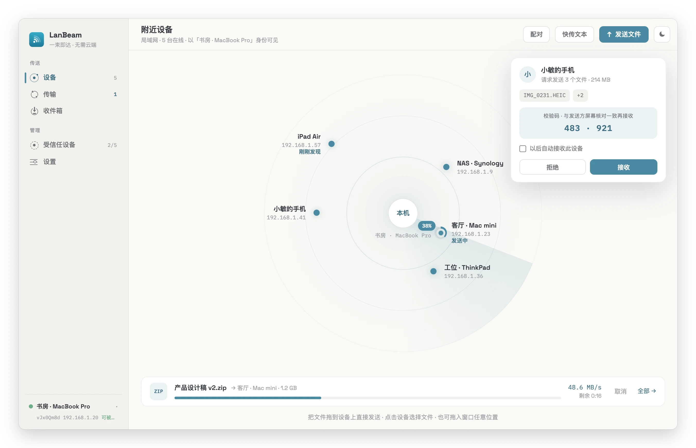
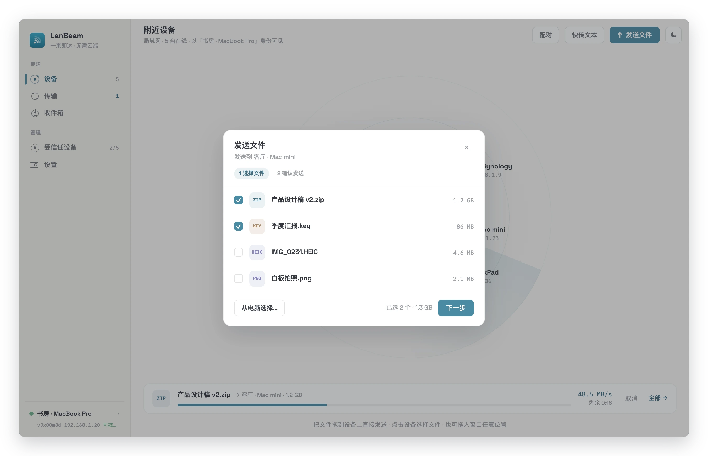
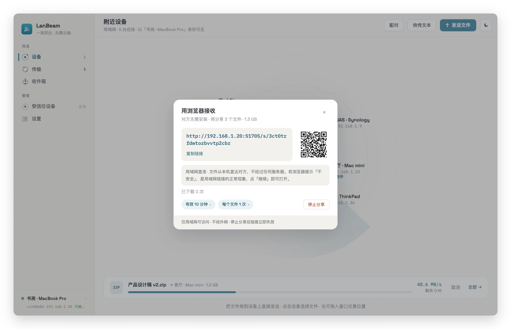
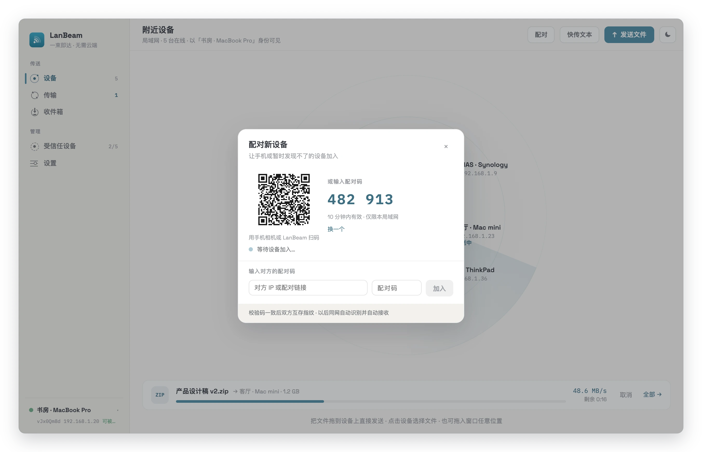
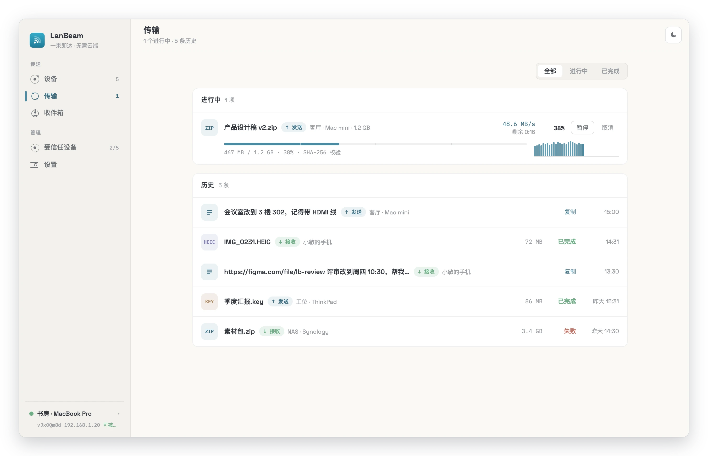
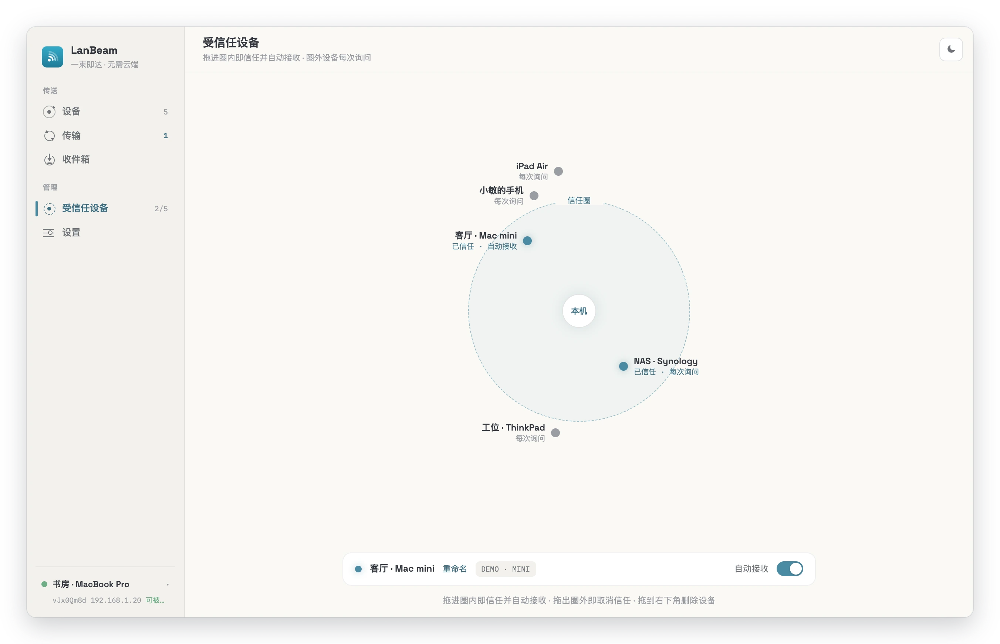
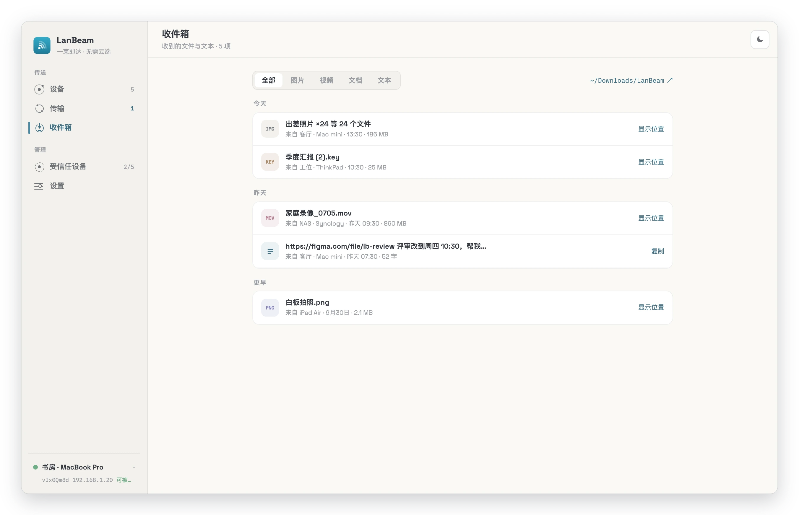
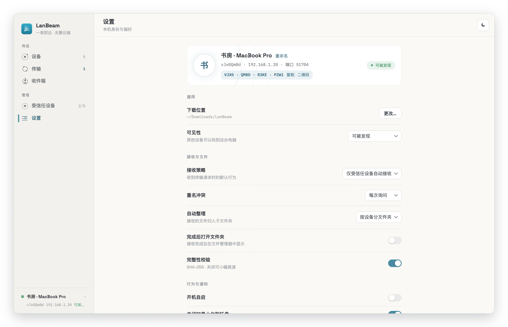
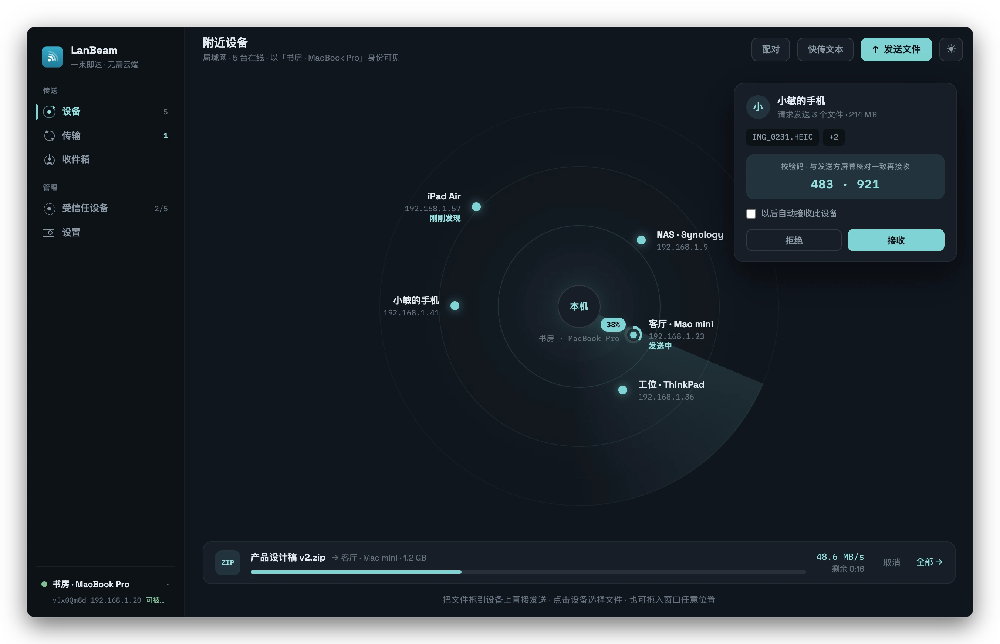

<p align="center">
  <picture>
    <source media="(prefers-color-scheme: dark)" srcset="assets/brand/banner-dark.svg">
    
  </picture>
</p>

<p align="center">
  <a href="https://github.com/Johnserf-Seed/lanbeam/releases/latest"></a>
  <a href="https://github.com/Johnserf-Seed/lanbeam/actions/workflows/ci.yml"></a>
  
  <a href="LICENSE"></a>
</p>

<p align="center"><a href="README.md">English</a> · <b>简体中文</b></p>

> 快速、私密、点对点的局域网文件传输 —— 不上云、不注册、不中转。

**LanBeam** 在同一局域网内的设备之间**直接**传输文件(和快传文本)。每次传输都走端到端加密信道,全程不碰公网。对于没装 LanBeam 的设备,它还能起一个一次性的、基于链接的 HTTP 下载 —— 手机浏览器不装任何 App 就能取走文件。

<picture>
  <source media="(prefers-color-scheme: dark)" srcset="docs/screenshots/zh/devices-dark.webp">
  
</picture>

基于 **Tauri 2**(Rust 内核 + WebView 界面):安装包只有几 MB,网页运行时用系统自带的(Windows 上是 WebView2,macOS / Linux 上是 WebKit),不额外内嵌任何东西。

- **状态:** `v0.1.0` —— 功能完整,发版前。
- **平台:** Windows 10/11、macOS 10.15+、Linux(x64)—— 每次发版由 CI 自动构建三个平台的安装包。
- **语言:** 英文 & 简体中文(应用内可切换)。

---

## 下载

到 **[Releases](https://github.com/Johnserf-Seed/lanbeam/releases/latest)** 下载最新版本:

| 系统 | 文件 | |
| --- | --- | --- |
| **Windows** 10 / 11(x64) | `LanBeam_<版本>_x64-setup.exe` | 安装版 —— 大多数人选这个 |
| | `LanBeam_<版本>_x64_en-US.msi` | 适合企业批量 / 脚本化部署 |
| | `LanBeam_<版本>_x64_portable.exe` | 便携版:免安装,双击即用 |
| **macOS** 10.15+ | `LanBeam_<版本>_universal.dmg` | 一个包同时支持 Apple 芯片和 Intel |
| **Linux**(x64) | `LanBeam_<版本>_amd64.deb` | Debian、Ubuntu、Mint … |
| | `LanBeam-<版本>-1.x86_64.rpm` | Fedora、openSUSE … |
| | `LanBeam_<版本>_amd64.AppImage` | 任意发行版 |

需要互传的**每台**设备都要装上 LanBeam。手机或没装 LanBeam 的电脑,也能通过[浏览器接收](#传输)拿到文件。

### 首次运行

安装包**尚未做代码签名**,所以第一次打开时系统会拦一下:

- **Windows** —— 若 SmartScreen 提示「Windows 已保护你的电脑」,点「更多信息 → 仍要运行」。防火墙弹窗时,允许 LanBeam 访问**专用网络** —— 别的设备正是靠这个才能连上它。
- **macOS** —— 若提示无法验证开发者,打开「系统设置 → 隐私与安全性」,点「仍要打开」。询问时请允许**本地网络**访问 —— 不允许的话,LanBeam 一台设备都看不到。
- **Linux** —— 给 AppImage 加可执行权限(`chmod +x LanBeam_*.AppImage`),或者安装软件包:`sudo apt install ./LanBeam_*_amd64.deb` / `sudo dnf install ./LanBeam-*.x86_64.rpm`。

### 校验下载文件

每个版本都附带 `SHA256SUMS.txt`,每个文件也都带有[构建来源证明(attestation)](https://docs.github.com/actions/security-for-github-actions/using-artifact-attestations),证明它确实由本仓库的发布工作流、从该 tag 的提交构建而来:

```bash
sha256sum -c SHA256SUMS.txt --ignore-missing
gh attestation verify LanBeam_0.1.0_x64-setup.exe --repo Johnserf-Seed/lanbeam
```

---

## 快速上手

1. **在同一网络下的两台设备上打开 LanBeam。** 几秒钟内双方就会出现在彼此的雷达上 —— 无需设置,无需注册。
2. **发送。** 把文件拖到雷达上的某台设备(或拖进窗口任意位置),也可以点一下设备再选文件。「快传文本」则用来发一段文字或链接,还可以直接放进对方的剪贴板。
3. **接收。** 接收方会看到谁要发什么,旁边还有一串校验码;和发送方屏幕上的一致,就点接收。勾选「以后自动接收此设备」后,这台设备再发来的文件会直接收下 —— 它已进入你的信任圈。
4. **对方没装 LanBeam?** 用「浏览器接收」:LanBeam 给出一个链接和二维码,手机扫码打开,文件直接从你的电脑下载过去。
5. **设备没出现?**(跨子网,或发现被路由器拦了)—— 用「配对」(6 位配对码或二维码),或输入对方地址「IP 直连」。

收到的文件默认存到 `下载/LanBeam`,还可以按设备或按日期自动归档(都在设置里)。

## 截图

<table>
  <tr>
    <td width="50%"><br><b>发送</b> —— 选文件、确认、完成</td>
    <td width="50%"><br><b>浏览器接收</b> —— 一次性局域网链接 + 二维码,给没装 App 的设备</td>
  </tr>
  <tr>
    <td><br><b>配对</b> —— 二维码或 6 位配对码,接入发现不了的设备</td>
    <td><br><b>传输</b> —— 实时速度、暂停 / 继续、校验过的历史</td>
  </tr>
  <tr>
    <td><br><b>信任圈</b> —— 拖进圈内即信任并自动接收</td>
    <td><br><b>收件箱</b> —— 收到的一切,文件和文本都在这</td>
  </tr>
  <tr>
    <td><br><b>设置</b> —— 接收策略、重名冲突、完整性校验、隐私</td>
    <td><br><b>深色模式</b> —— 跟随系统,或手动切换</td>
  </tr>
</table>

---

## 功能

### 传输
- **局域网内直接 P2P** —— 设备通过轻量的自研 UDP 发现协议(**非** mDNS)互相找到并直连,中间没有服务器。
- **端到端加密** —— 每次会话都是一次 `Noise_XX_25519_ChaChaPoly_BLAKE2s` 握手(基于 [`snow`](https://crates.io/crates/snow) crate)。设备以静态 X25519 密钥标识;一段简短的 **SAS(校验码)** 让你可以带外核对对端。
- **完整性校验** —— 文件流式过 SHA-256,接收端在落地前重新哈希核对(可开关)。
- **续传、暂停与取消** —— 中断的传输从持久化的字节偏移继续;暂停施加背压(有时限,会自动恢复);取消立即释放并发槽。
- **重名冲突策略** —— `rename`(去重)、`overwrite`(崩溃安全:先写临时文件、整批成功后才原子替换)、或 `ask`。
- **自动整理** —— 按发送设备或按日期归档收到的文件。
- **并发上限与限速**,以及逐文件进度。
- **浏览器接收** —— 把指定的一组文件通过一次性 HTTP 分享出去:不可猜的 token 链接 + 有效期 + **每个文件**的下载次数上限(K 个文件的分享,总预算就是上限 × K)+ 一键停止 —— 仅限局域网,文件按索引寻址(无路径/穿越面)。**任何分享(包括单文件)**对方看到的都是一个品牌落地页,并**按对方浏览器的语言**渲染(读 `Accept-Language`);而每一次下载都会回传给你:带下载方 IP 的提示、传输历史里的一条记录、系统通知,以及分享面板上实时跳动的计数。**关掉分享面板并不会停止分享** —— 你交给别人的链接,不该因为你关掉了复制它的那个面板就失效 —— 所以只要有分享还活着,侧栏就一直显示它,而那个指示器就是你回去停掉它的入口。

### 配对与触达
- **配对** —— 6 位配对码(10 分钟有效)、可扫二维码,或 [`lanbeam://` 深链接](#深链接lanbeam)。**兑换配对码只能证明码是对的,证明不了拿着码的是谁**:随后两台屏幕会显示**同一个校验码(SAS)**,双方**各自**确认一致,才写入信任。握手本身从不授予任何信任。
- **IP 直连** —— 用于自动发现看不到的对端(不同子网)。
- **快传文本** —— 通过加密信道发一段文字/链接,可选择直接落到对方剪贴板。文本没有接收确认框,所以它遵守和文件一样的规矩:**未受信的发送方会被丢弃 —— 而且 ack 会如实告知,发送方拿到的是一个真实的错误,不是一句假的「已送达」**。另有按来源的洪水限流。

### 隐私与系统集成
- **元数据抹除** —— 发送时剥离 JPEG/PNG/WebP 的 EXIF / ICC / XMP,采用容器级手术(不重编码,像素逐字节不变)。
- **信任存储** —— 记住的对端(`deviceId → 名称、自动接收、配对时间`)。**信任一台设备也会同时开启「自动接收」**(「这是我自己的设备」本就该是这个意思);想让某台仍逐次确认,单独关掉它的自动接收即可。**删除设备**会同时清掉它的信任行**和**当初让它留在设备列表里的手动地址 —— 单纯「取消信任」做不到这一点。另外,任何路径都不再允许把**本机**记成自己的对端。
- **指纹变化** —— 当一个记住的名字换了**另一把密钥**出现时,告警会把新旧指纹并排列给你看。它**不做任何自动撤销**:新密钥本就从未被信任 —— 它就是另一台设备。只有两条诚实的出路:删除旧记录,或者**像对待新设备一样去配对** —— 那是唯一会把同一个校验码放到两块屏幕上的流程。
- **托盘是个真正的遥控器** —— 状态行(设备名 + 局域网 IP)、发送文件 / 快传文本 / 浏览器接收 / 配对、可被发现的实时勾选、打开下载目录、直达收件箱 / 传输 / 设置、退出。它跟随 App 的语言,勾选状态与侧栏双向同步。
- **它的行为像桌面应用,而不像网页** —— 浏览器右键菜单被替换成 App 原生的剪切/复制/粘贴菜单;WebView 的浏览器快捷键(Ctrl+F 查找栏、Ctrl+P、Ctrl+S、Ctrl+U)全部封禁。DevTools 只存在于 dev 构建。
- **界面缩放** —— 80–150%,给高分屏,也给眼睛。它同时作用于 WebView **和窗口的最小尺寸**:缩放会缩小 CSS 视口,若最小尺寸不跟着变,用户就能把界面放大到自己窗口外面去。`Ctrl` `+` / `-` / `0` 驱动的是 App 自己的设置 —— WebView 原生的缩放依然关着,浏览器的东西在这里不是功能。
- 关闭最小化到托盘、系统通知、开机自启、可选的全局快捷键、网络接口过滤,以及一键重置身份。

---

## 常见问题

<details>
<summary><b>两台设备互相看不到</b></summary>

- 两台设备必须在同一网络里,而且这个网络得允许设备之间互相通信:访客 Wi-Fi 和「AP 隔离 / 客户端隔离」拦的正是这个,部分 VPN 也会。
- **Windows:** 网络类型应设为「专用网络」,并允许 LanBeam 通过防火墙访问专用网络。
- **macOS:** 「系统设置 → 隐私与安全性 → 本地网络」里要允许 LanBeam。
- 跨子网,或者路由器丢弃了组播 / 广播:用「配对」或「IP 直连」—— 两者都直接按地址连接,不依赖发现。
- 如果你自己管理防火墙:发现走 UDP `51703`(组播 `239.255.61.17` + 广播),传输走 TCP `51704`(可在设置里修改),浏览器分享用的是启动时随机分配的端口。
</details>

<details>
<summary><b>会不会有数据上公网?</b></summary>

不会。发现、传输、浏览器分享都只在局域网内进行 —— 分享服务甚至会直接拒绝来自私有网段以外的任何请求。没有账号、没有遥测、不检查更新,连界面用的字体都是打包在应用里的,而不是联网加载。
</details>

<details>
<summary><b>收到的文件、设置和日志在哪?</b></summary>

文件默认存到 `下载/LanBeam`,也可以在设置里换一个「下载位置」。设置和日志放在系统惯用位置下的 `LanBeam` 文件夹里:

| | 数据 | 日志 |
| --- | --- | --- |
| Windows | `%APPDATA%\LanBeam` | `%LOCALAPPDATA%\LanBeam\logs` |
| macOS | `~/Library/Application Support/LanBeam` | `~/Library/Logs/LanBeam` |
| Linux | `~/.local/share/LanBeam` | `~/.config/LanBeam/logs` |

设备私钥不在这些目录里 —— 它存在系统钥匙串中。「设置 → 导出诊断包」会把日志和网络自检打包成一个文件。
</details>

<details>
<summary><b>macOS 更新后弹窗询问钥匙串访问</b></summary>

LanBeam 把设备密钥存在你的登录钥匙串里。安装包是 ad-hoc 签名的,所以每个新版本在 macOS 看来都是「另一个 App」,会询问一次能否读取这把密钥 —— 选「始终允许」即可。这把密钥**就是**这台设备的身份:对端们 pin 住的正是它。
</details>

<details>
<summary><b>Linux:LanBeam 启动不了,或者没有托盘图标</b></summary>

- 设备密钥通过 Secret Service 存储,所以必须有一个钥匙环服务在运行 —— GNOME Keyring 或 KWallet。桌面环境一般都自带;如果是纯窗口管理器,请安装 `gnome-keyring`。
- 托盘需要 AppIndicator 支持。原生 GNOME(比如 Fedora)需要安装「AppIndicator and KStatusNotifierItem Support」扩展。没有它的话,关闭窗口后 LanBeam 会缩进一个你看不见的托盘 —— 再启动一次 LanBeam 就能把窗口叫回来,或者在设置里关掉「关闭时最小化到托盘」。
</details>

---

## 安全模型(速览)

- 设备的 X25519 私钥存在 **操作系统钥匙串**(`keyring`)里,绝不明文落盘。
- 所有对端流量端到端加密(Noise);应用不打开任何公网连接。
- 不可信输入按敌对处理:manifest 的文件名/大小/数量都有上限,接收路径针对目录穿越和 Windows 保留名/ADS 花招做净化,配对是 TOFU + 用户确认 + 带外 SAS 核对。`lanbeam://` 深链接**只能「调出窗口 / 预填 / 跳转」,绝不执行动作**(见下文)。
- 浏览器分享服务器监听所有接口 —— 它必须如此,否则一次 DHCP 续租就会打断所有正在进行的分享 —— 所以**「仅限局域网」是在中间件里逐请求执行的,在任何 handler 跑起来之前**:来自非私有网段的请求一律拒绝,它连 token 是不是真的都无从得知。(是「私有网段」,不是「我这个子网」:跨子网的对端是刻意支持的。)它只按索引服务那组明确的文件,每次请求都用 token + 有效期 + 每文件下载次数重新把关。

依赖漏洞用 `cargo audit` 跟踪;已接受的传递依赖告警记录在 [`src-tauri/.cargo/audit.toml`](src-tauri/.cargo/audit.toml)。

---

## 深链接(`lanbeam://`)

任何东西都能让系统打开一个 `lanbeam://` 链接 —— 一个网页、一张二维码、一条聊天消息。所以 LanBeam 把它们**一律当作敌对输入**,整套协议围绕一条铁律设计:

> **深链接只能:调出窗口、预填某个输入框、跳转到某个页面。
> 它永远不能:配对、连接、发送、授予信任、开启分享、修改设置。**

**一个能替你做决定的链接,就是一个攻击者能替你做决定的链接。** 所以这里**故意没有** `lanbeam://send`、没有 `lanbeam://trust`、没有 `lanbeam://accept` —— 而「加一个会执行动作的命令」正是这份文件里唯一绝不能做的改动。

| 链接 | 它做什么 | 它**不**做什么 |
| --- | --- | --- |
| `lanbeam://pair?d=…&n=…&a=…&p=…&c=…` | 打开配对表单并预填 | 不配对。你仍需核对 SAS。 |
| `lanbeam://text?t=<urlencoded>` | 打开快传文本并预填内容 | 不发送。你仍需选择设备。 |
| `lanbeam://connect?a=<ip[:端口]>` | 跳到设备页并预填地址 | 不连接。你仍需点「IP 直连」。 |
| `lanbeam://devices` · `transfers` · `inbox` · `settings` | 跳转到对应页面 | 不携带任何参数 |
| `lanbeam://open` | 仅把窗口调到前台 | 别的都不做 |

未知命令一律**丢弃,而非猜测**;链接带来的值都有长度上限,防止塞爆界面。后端**根本不解释链接**:它只校验协议头、把窗口调出来,然后把原始 URL 交给前端 —— 白名单与解析都在 [`src/lib/deepLink.ts`](src/lib/deepLink.ts),并且专门针对「攻击者会构造的那类链接」写了单测。

冷启动同样有效:**启动**应用的那个链接会被后端暂存,等界面挂载后重放一次(Tauri 事件没有回放机制)。

---

## 技术栈

| 层 | 选型 |
|---|---|
| 外壳 | Tauri 2(Rust)+ 系统 WebView(WebView2 / WebKit) |
| 后端 | Rust、`tokio`、`snow`(Noise)、自研 UDP 发现、`axum`(分享服务)、`img-parts`(EXIF)、`keyring`、`sha2` |
| 前端 | React 19、TypeScript(strict)、Vite、`zustand`、`react-i18next` |
| 工具 | pnpm、Biome(lint/format)、Vitest、`cargo clippy` / `rustfmt` / `cargo-llvm-cov`、Playwright(截图) |

---

## 从源码构建

### 前置依赖
- [Rust](https://www.rust-lang.org/tools/install) —— stable 工具链(≥ 1.85)
- [Node.js](https://nodejs.org) ≥ 20.19 和 [pnpm](https://pnpm.io)。pnpm 版本已在 `package.json` 的 `packageManager` 字段锁定;`corepack enable`,或任意 ≥ 9.7 的 pnpm 都会自动切换到它。
- 对应操作系统的 [Tauri 2 系统前置依赖](https://tauri.app/start/prerequisites/)(Windows 上:MSVC 构建工具 + WebView2 运行时,后者 Windows 10/11 自带;Linux 上:[`ci.yml`](.github/workflows/ci.yml) 里安装的那些包)。

### 安装
```bash
pnpm install
```

### 开发
```bash
pnpm tauri dev      # 带热重载运行桌面应用
# 或只在浏览器里跑 Web 界面(后端调用回退到 demo 桩):
pnpm dev            # 然后打开 http://localhost:1420/?demo=1 查看示例数据
```

### 构建
```bash
pnpm tauri build    # 产出当前平台的全部安装包,位于
                    # src-tauri/target/release/bundle/
```

### 截图
```bash
pnpm screenshots    # 用浏览器 demo 重新生成 docs/screenshots/
```
会调用本机已安装的 Chrome 或 Edge(也可用 `CHROME_PATH` 指定);可用参数见 [`scripts/screenshots.mjs`](scripts/screenshots.mjs)。

---

## 项目结构

```
.
├── .github/workflows/    # ci.yml(lint + 测试,三平台)· release.yml(安装包)
├── assets/brand/         # logo、横幅(设计源文件在旁边)
├── docs/screenshots/     # README 截图(生成:pnpm screenshots)
├── scripts/              # set-version.mjs · screenshots.mjs
├── src/                  # React + TypeScript 前端
│   ├── bridge/api.ts     #   Tauri 命令/事件的类型化封装(+ 浏览器桩)
│   ├── lib/
│   │   ├── store.ts      #     zustand 状态仓库(需要时持久化)
│   │   ├── deepLink.ts   #     lanbeam:// 白名单与解析(那条安全铁律)
│   │   ├── demo*.ts      #     ?demo=1 示例数据,跟随界面语言
│   │   └── browserShortcuts.ts  # 把浏览器从 WebView 里剥出去
│   ├── components/       #   弹窗、外壳、共享 UI 原语
│   ├── pages/            #   设备 / 传输 / 收件箱 / 已信任 / 设置
│   └── i18n/             #   en + zh 语言包
├── src-tauri/            # Rust 后端(应用内核)
│   └── src/
│       ├── discovery/    #   UDP 局域网发现 + 接口枚举
│       ├── transport/    #   Noise 握手 + 帧
│       ├── transfer.rs   #   收发状态机、续传、完整性、冲突
│       ├── share.rs      #   axum 一次性浏览器分享服务 + 它的落地页
│       ├── tray.rs       #   托盘「遥控器」(Rust 只管显示/退出,其余交给界面)
│       ├── paths.rs      #   数据/日志目录 —— 用产品名 LanBeam,而不是 bundle id
│       ├── sanitize.rs   #   接收路径安全(唯一的写入 choke point)
│       ├── trust.rs      #   信任存储  ·  exif.rs —— 元数据抹除
│       └── commands.rs   #   Tauri 命令面
├── ROADMAP.md            # 后端里程碑(M4–M8 已交付;M9 只交付了 EXIF,更新检查待做)
└── vitest.config.ts
```

---

## 测试

```bash
# 前端(Vitest + Testing Library)
pnpm test
pnpm test:coverage

# 后端(在 src-tauri/ 下)
cargo test
cargo clippy --all-targets
cargo fmt --check
cargo llvm-cov --summary-only -- --test-threads=1   # 覆盖率
```

> **Windows 注意:** 后端测试串行跑(`-- --test-threads=1`)。MockRuntime 集成测试在并行时可能偶发原生层崩溃(`0xc0000005`),那是环境抖动、不是逻辑错误,重跑即可。

每次 push / PR 都会在 [CI](.github/workflows/ci.yml) 跑同一套测试:前端 job 在 Linux,**后端套件在 Windows、macOS 和 Linux 三个平台**上跑。这个矩阵不是为了好看 —— 这个 crate 曾经只编进了 Windows 的 `keyring` 后端,于是 macOS/Linux 上 keyring **静默回落到内存 mock**:每次启动都重新生成一把设备密钥,导致所有对端 pin 住的指纹全部作废。仓库里自带的 `identity_is_stable_across_loads` 一秒就能证明这件事 —— 它只是从来没在 Windows 之外跑过。

---

## 打包与发版

`pnpm tauri build` 会产出**当前平台的全部打包目标**(`bundle.targets: "all"`):Windows 上是 **NSIS 安装包 + MSI**,macOS 是 `.app` + `.dmg`,Linux 是 `.deb` / `.rpm` / AppImage。裸的 `src-tauri/target/release/lanbeam.exe` 也能独立运行 —— 这就是便携版。

发版由 [`release.yml`](.github/workflows/release.yml) 完成:

1. `pnpm version:set 0.2.0` —— 一次性把版本号写进 `package.json`、`tauri.conf.json`、`Cargo.toml` 和 `Cargo.lock`(工作流会拒绝与它们不一致的 tag)。
2. 提交后打 tag 并推送:`git tag v0.2.0 && git push origin v0.2.0`。
3. CI 并行构建 Windows、macOS(通用包)和 Linux,把所有安装包、便携版 exe、`SHA256SUMS.txt` 和构建来源证明一起挂到一个**草稿** Release 上。
4. 检查草稿无误后,点发布。

凡是改动了打包相关文件(Tauri 配置、图标、锁文件、工作流本身)的 PR,也会跑同样的三平台构建,并把安装包作为 workflow artifacts 附在运行记录上 —— CI 只负责编译和测试,这一步才能证明改动后**还能打包**。任意分支也可以在「Actions → Release → Run workflow」手动触发。两者都不会发布任何东西。

说明:
- **代码签名** —— 目前还没有。macOS 包做了 ad-hoc 签名(Apple 芯片上,未签名的下载文件必须至少有它才能打开)。在仓库 secrets 里加上 `release.yml` 列出的那几个 `APPLE_*`,即可启用 Developer ID 签名 + 公证。
- **不内嵌 WebView2** —— Windows 使用系统 Evergreen 运行时,Windows 10/11 自带。
- [`lanbeam://` 协议](#深链接lanbeam)由安装器注册;便携版首次运行时会自行注册该协议(按用户,写 HKCU)。
- **DevTools 不会被打包进去。** `devtools` 不在 Tauri 的默认 feature 里,本项目也没开启 —— 所以 release 构建把审查器整个编译掉了,**打包后的应用里按 F12 没有任何反应**。它只在 `tauri dev` 下可用。

---

## 许可证

以 [MIT 许可证](LICENSE) 发布。第三方组件及其许可证在应用内 **设置 → 关于 → 开源许可** 中列出。
